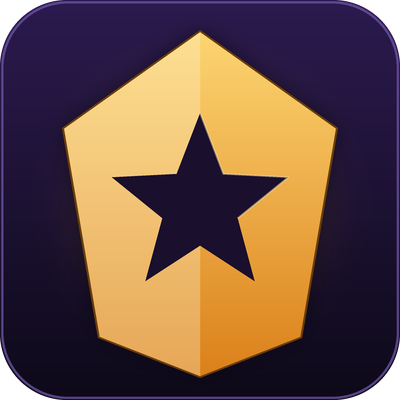

# PugRater

Records every Mythic+ run you do, rates the players you ran with, organises them
into a taggable roster, and lets you message groups of them by tag. The point is
to be able to recommend good players early in a season based on your own positive
experiences, rather than a score someone else computed.

Retail WoW (Midnight, 12.1). No libraries, no dependencies.

## What it does

**Captures every key.** From `CHALLENGE_MODE_START` to `CHALLENGE_MODE_COMPLETED`
it records the dungeon, key level, affixes, timer result and upgrade level, plus
a per-player observation for all five of you: deaths, wipes, interrupts, dispels,
crowd control, damage and healing, item level and spec, and whether anyone left
early. On Midnight (interface 120000+) the combat log is closed to addons, so the
per-player combat tallies are unavailable there and Details supplies damage and
healing instead -- Options tells you which is in effect, and outcome-based rating
is unaffected either way. Party, instance and whisper chat is logged alongside the run. The
in-progress record lives in SavedVariables, so a `/reload` mid-key loses nothing.

**Rates them.** Outcome dominates -- timed, upgrade level, completion -- and
per-player stats adjust within that band. Contribution scales with key level, a
tank or healer death weighs heavier than a DPS death, and previous seasons decay.
A small sample cannot leave Neutral, and every tier is explainable: the roster
panel shows the per-run breakdown, and `/pugdebug tier <name>` prints the full
arithmetic, weight by weight.

**Organises them.** A person is the human; characters link under them. Battle.net
friends auto-link when the friends list exposes the mapping; anyone else can be
linked by hand. Manual tags (relationship, play style, availability, voice, plus
anything you invent) sit on the person; auto-tags (role, spec, item level bracket,
Raider.IO bracket, computed tier) are derived and always current. The filter
builder combines both -- `role = healer AND ilvl >= 640 AND tag = push` -- and any
filter can be saved as a named group.

**Messages them.** Pick a saved group, preview the exact expanded message for
every online recipient, uncheck anyone, and send with a configurable stagger.
Templates support `{name} {key} {dungeon} {mykeylevel} {tier} {runs} {me}`.
Battle.net whisper when the account is known, character whisper otherwise.
Per-person cooldowns and a `do-not-message` tag are enforced in the send path
itself, so a manual send from the roster obeys them too. Replies show up verbatim
next to each name with a one-click invite -- no guessing at intent.

**Shows it where you need it.** Tier and note on player tooltips, a colour badge
on group-finder applicants, and a dismissible toast when someone you have rated
joins your group.

## Install

CurseForge, Wago, or WoWInterface via your addon manager, or grab the zip from
[Releases](../../releases) and unpack it into
`World of Warcraft/_retail_/Interface/AddOns/`.

## Commands

| Command | What it does |
| --- | --- |
| `/pugrater` or `/pr` | open the roster |
| `/pr history` | run history browser |
| `/pr send` | messaging panel |
| `/pr options` | settings, tags, data tools |
| `/pr rate` | recompute provisional tiers now |
| `/pr note <name> <text>` | quick note without opening the UI |

## Development builds

Everything under `PugRater/Debug/` exists so the addon can be developed without
running a 30-minute key per iteration. The release packager strips the folder
(`.pkgmeta` `ignore` plus a `#@debug@` block in the `.toc`), so shipped builds
contain no debug code at all rather than debug code that is switched off.
Production files only ever reach it through a guarded feature-detect.

Everything below is also on the **Debug tab** in the main window, which is the
easier way in: one pane with the generators, the removers, the messaging sandbox,
the tier/export inspectors and a taint capture. The tab exists only in a
development build, because the file that registers it lives in `Debug/`.

```
/pugdebug on|off               master switch; off makes the addon behave as a released build
/pugdebug run 12 Voidspire     simulate a full key through the real event pipeline
/pugdebug run --disband        force the interesting failure cases (--fail --leave --wipes)
/pugdebug seed 50              bulk-generate history for rating and decay testing
/pugdebug roster               seed persons, tags, links and saved groups
/pugdebug online on|off        fake a friends list so the Send tab has recipients
/pugdebug echo on|off          intercept sends and print them locally (off by default)
/pugdebug reply <name> <text>  simulate a whisper back
/pugdebug tier <name>          print the full rating breakdown
/pugdebug export               dump the in-progress run
/pugdebug wipe [fake]          clear everything, or only simulated records
/pugdebug popup on|off         show or silence the blocked-action popup while debugging
```

`run` fires the addon's real handlers with synthetic payloads, so the capture
pipeline is genuinely exercised end to end; `seed` writes finished records
directly, which is what you want when you need fifty runs of history rather than
one run of capture.

### Debug mode

`/pugdebug off`, or the checkbox at the top of the Debug tab, makes PugRater
behave exactly as a released build does. It is not a UI-level lie: production
code reaches debug functionality only through `if ns.Debug and ns.Debug.X then`,
so switching off clears the seams themselves -- `EchoSend`, `EchoInvite` and the
fake online index all go nil, and the real send path, the real friends list and
the real block rules are what run. Slash commands other than `on`/`off` refuse
while it is off.

The flag lives at `PugRaterDB.debugEnabled` rather than in `settings`, so no
debug key ever appears in the production defaults table. Absent means on.

### The `debug` flag

Simulated data is flagged rather than segregated, so it travels the same code
paths as real data and gets tested by being used. Every record a seed can create
carries `debug = true`:

| Record | Flagged by |
| --- | --- |
| `db.runs[]`, `db.activeRun` | the simulator that wrote them |
| `db.characters[guid]` | the simulator that wrote them |
| `db.persons[id]` | derived: true while *every* character under the person is |
| `db.savedGroups[name]` | the roster seeder |
| `db.sentLog[]`, `person.sentLog[]` | seeded recipient, or an echoed send |

Four rules follow from that flag, and all of them are load-bearing:

1. **Flagged records are never acted on for real.** `Sender.BlockReason` blocks
   a simulated person outside echo mode and `Replies.Invite` refuses to invite
   one, so a seeded name cannot be whispered or invited by accident. The roster
   and send lists mark them `[sim]` so they are obvious on sight.
2. **Flagged records do not survive the session.** A fresh login drops whatever
   the last session seeded. They deliberately survive a `/reload`, because
   resuming a key across one is a feature that needs testing.
3. `/pugdebug wipe fake` removes exactly the flagged records and nothing else.
4. **The companion app must never import a record with `debug = true`** -- not
   into SQLite, not into the Blizzard or Raider.IO enrichment, not into the
   refined tiers it writes back. Test data that reaches the database stops being
   distinguishable from real history.

The person flag is derived rather than set, because linking a real alt onto a
seeded main makes that person real; `Roster.RefreshDebugFlag` recomputes it on
every attach, link and touch.

## Companion app

The Python companion (`companion/`) is not built yet. When it lands it reads
SavedVariables into SQLite, enriches with the Blizzard and Raider.IO APIs,
recomputes refined tiers over the full history, and writes `PugRater_Lookup.lua`
back into the addon folder. The addon already reads that file and prefers refined
tiers over its own when they are present -- `PugRater_Lookup.lua` ships as an
empty stub, and its absence never breaks anything.

## Layout

```
PugRater/
  Core.lua            namespace, saved variables, event dispatch
  Housekeeping.lua    storage budget, pruning, database maintenance
  Capture/            run lifecycle, combat log, chat, inspect, Details bridge
  Rating/             provisional tier computation, companion lookup reader
  Roster/             persons, characters, tags, filters, saved groups
  Messaging/          templates, send queue, reply tracking
  UI/                 window, roster, history, send, options, tooltip, badges
  Debug/              simulation suite and its panel (stripped from releases)
  PugRater_Lookup.lua companion-generated enrichment; ships as an empty stub
```

## License

MIT. See `LICENSE`.
